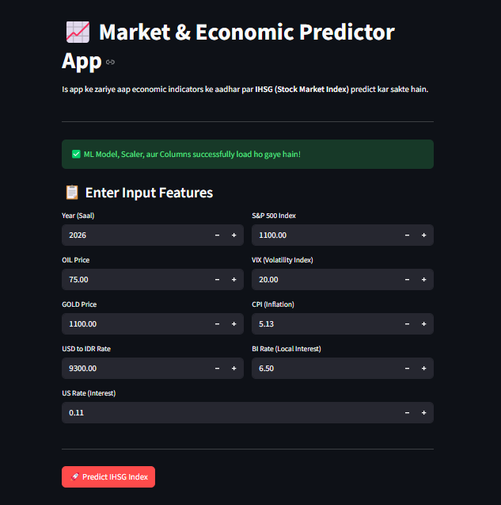

# 📈 Market & Economic Predictor App

An interactive Machine Learning web application built with **Streamlit** that predicts the **IHSG (Jakarta Composite Index)** using various global and local macroeconomic indicators.

The application architecture is optimized to model long-term financial relationships by capturing yearly macro-trends combined with strategic feature scaling.

---

## 📸 User Interface Preview

Here is a glimpse of the application's user interface, showcasing the interactive input fields and the prediction output.



---

## 🚀 Live Demo

🔗 **Deploy your live Streamlit link here:** `https://share.streamlit.io/your-username/your-repo-name`

---

## 📊 Model Evaluation & Selection

We trained and evaluated **12 different Machine Learning algorithms** to find the most robust model for predicting the stock index. Below is the benchmarking performance:

| Index | Model Name                       | $R^2$ Score  |           MSE            |     MAE     |    RMSE     |
| :---: | :------------------------------- | :----------: | :----------------------: | :---------: | :---------: |
|   0   | Linear Regression                |   0.916170   |   $1.6210 \times 10^5$   |   314.516   |   402.621   |
|   1   | Ridge Regression                 |   0.916178   |   $1.6209 \times 10^5$   |   314.494   |   402.604   |
|   2   | Lasso Regression                 |   0.916198   |   $1.6205 \times 10^5$   |   314.455   |   402.555   |
|   3   | ElasticNet                       |   0.916053   |   $1.6233 \times 10^5$   |   314.411   |   402.904   |
|   4   | Decision Tree                    |   0.993063   |   $1.3414 \times 10^4$   |   66.301    |   115.821   |
|   5   | Random Forest                    |   0.996491   |   $6.7853 \times 10^3$   |   50.724    |   82.373    |
|   6   | Extra Trees                      |   0.997667   |   $4.5116 \times 10^3$   |   42.593    |   67.168    |
| **7** | **Gradient Boosting (Selected)** | **0.988472** | **$2.2292 \times 10^4$** | **110.180** | **149.307** |
|   8   | K-Neighbors                      |   0.993617   |   $1.2342 \times 10^4$   |   68.790    |   111.097   |
|   9   | Support Vector Regressor         |  -0.023504   |   $1.9791 \times 10^6$   |  1188.730   |  1406.835   |
|  10   | XGBoost                          |   0.996126   |   $7.4910 \times 10^3$   |   58.154    |   86.550    |
|  11   | AdaBoost                         |   0.963039   |   $7.1473 \times 10^4$   |   218.113   |   267.345   |

### 🎯 Why Gradient Boosting?

While ensemble tree models like Extra Trees and Random Forest showed slightly higher $R^2$ scores, **Gradient Boosting Regressor** was selected as the final production model with an outstanding **~98.8% accuracy ($R^2 = 0.9884$)**. It provides the best balance between high predictive power and generalization, preventing overfitting on highly volatile financial time-series data.

---

## 🛠️ Features & Architecture

- **Production Model:** Gradient Boosting Regressor (`model.pickle`)
- **Engineered Input Feature:** `Year` (Extracted as an Integer to model annual macro trends without scaling)
- **Continuous Input Features:** `OIL`, `GOLD`, `USDIDR`, `SP500`, `VIX`, `CPI`, `BI_rate`, `US_rate`
- **Preprocessing:** Continuous features are normalized using `StandardScaler`. The temporal `Year` attribute bypasses scaling to preserve its chronological weight.
- **Error Handling:** Built-in validation system ensuring the Streamlit UI safely displays status messages even if dependencies or `.pickle` artifacts are temporarily missing.

---

## 📂 Project Structure

```text
├── app.py               # Streamlit UI Web Application
├── model.pickle         # Production Gradient Boosting Model (Joblib)
├── scaler.pickle        # Fitted StandardScaler Instance
├── columns.pickle       # Saved Feature Columns array
├── ui_screenshot.png    # App UI Preview Image (Manually Add!)
├── requirements.txt     # Environment Dependencies
└── README.md            # Project Documentation

🚀 An interactive Streamlit Web App that predicts the Indonesian Stock Market Index (IHSG) based on global economic indicators (Gold, Oil, S&P 500, VIX, CPI, Interest Rates). Powered by a trained Machine Learning Regressor with annual macro-trend tracking and feature scaling. Developed for robust financial analytics. 📊📈
```
